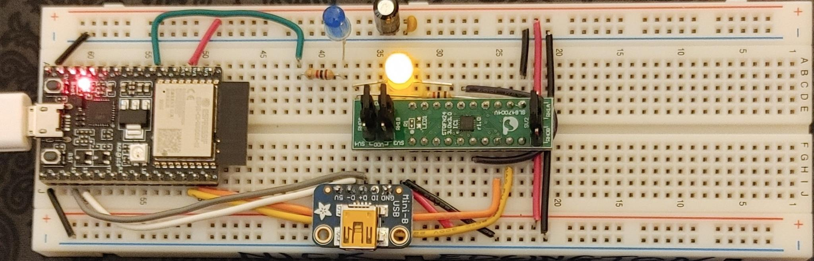
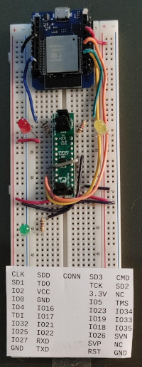

# The "White" Edger development board ('cause solderless breadboards are white!)
The White board is an Edger-compatible hardware system that can be made with off the shelf parts. At a minimum:
1. An ESP32 dev board
2. A Renesas "FORGEFpga" (formerly Dialog GreenPak) mixed signal FPGA on a DIP board. The project is currently focused on the SLG47004V-DIP that contains analog amplifiers and programmable variable resistors as well as logic. See 
3. A long (830 point) solderless breadboard
4. LEDs (Vf < 3.3v) with 1k current limiting resistors
5. Jumper wires
6. USB cable(s) as needed

## Version 2

The version 2 White board features an Espressif ESP32-C3-DEVKIT-02 that will be used in the next generation "Purple Board". It supports serial JTAG debugging. An LED connected to GPIO pin 4 is also present.

See the r2 subdirectory for details.

## Version 1

The version 1 White Board is based on an inexpensive ESP32 dev board avalable from Amazon or other sources.

See the r1 subdirectory for details.
